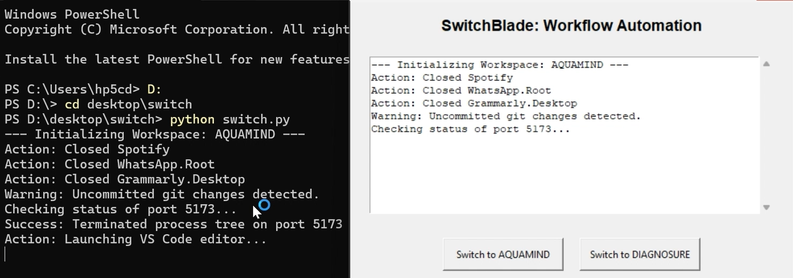
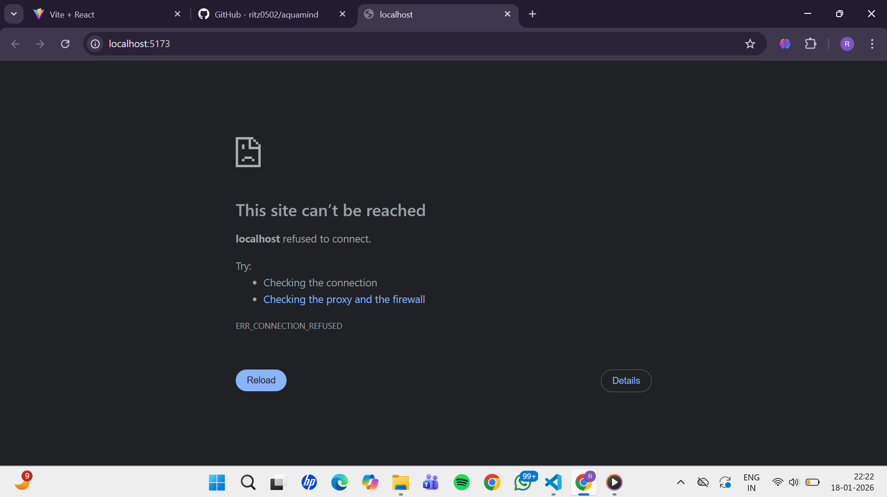
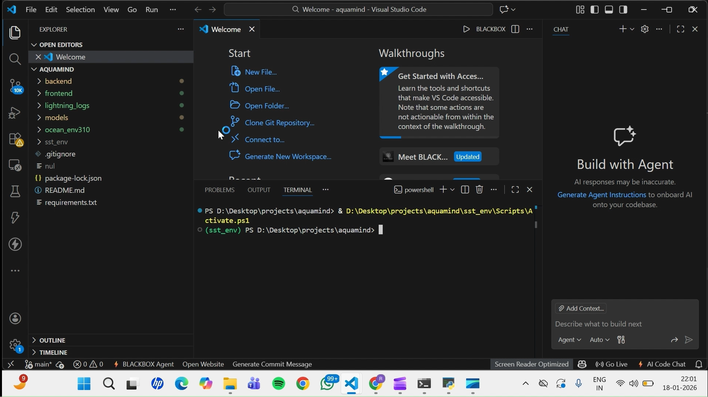
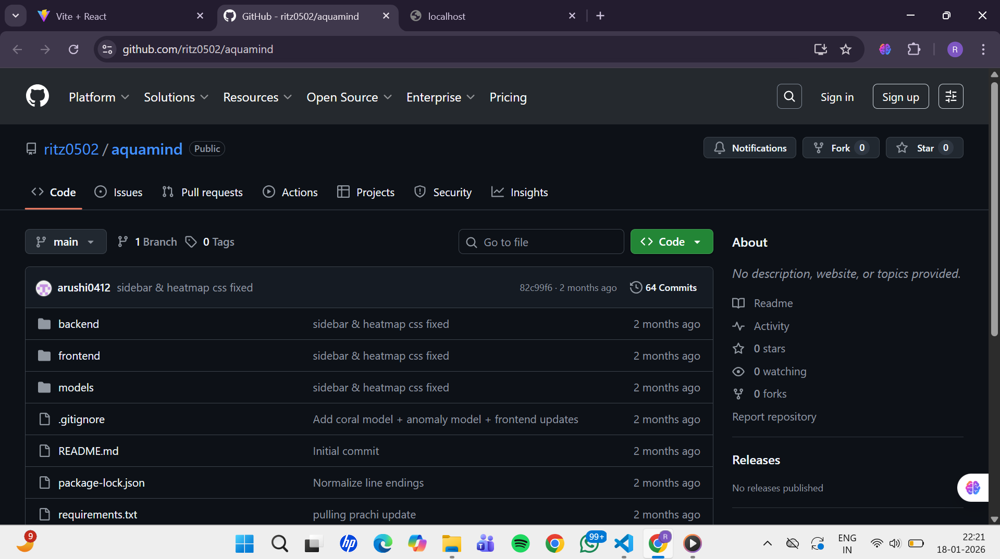

# Switch: Developer Context-Switching Utility

## 1. The Problem
As a developer, when I work on multiple high-stakes projects (such as I'm working with my projects DiagnoSure and AquaMind), I identify a significant "Focus Leak" in my workflow.

Every time I switch projects, I have to:

- **Manually Clear Ports**: React/Vite automatically increments ports to 5174 or 5175 if 5173 is occupied. This leads to Resource Leakage and cluttered workspaces. I designed Switch to enforce a Single Source of Truth—by killing whatever is on 5173, I ensure my current project always runs on my preferred port.

- **Manage Distractions**: Apps like WhatsApp and Grammarly create notification fatigue during deep-work sessions.

- **Manual Setup**: Opening specific folders and documentation links manually is a repetitive, low-value task.

Switch handles environment teardown and setup in one step, ensuring a clean "Flow State" transition.

---

## 2. Configuration (config.json)
The utility uses a JSON-based configuration to define the "Desired State" of each workspace.

### Structure Breakdown:
- **path**: The absolute local directory of your project. This is used to launch VS Code and check Git status.

- **ports**: A list of integers representing network ports to be cleared (e.g., 5173).

- **urls**: A list of strings (GitHub repos, localhost, or documentation) to be opened in the default browser.

- **apps_to_close**: The exact process names (e.g., WhatsApp.Root, Spotify) to be terminated.

---

## 3. How to Run

### Prerequisites
- Python 3.x  
- VS Code CLI (`code` command must be in your System PATH)

### Steps
1. Place `switch.py` and `config.json` in the same folder.
2. Ensure your `config.json` paths use `/` or `\\`.
3. **GUI Mode**: Run `python switch.py` to open the Dashboard.
   
4. **CLI Mode**: Run `python switch.py [workspace_name]` (e.g., `python switch.py aquamind`).

---

## 4. Expected Outputs
When a workspace is activated, the following actions occur in sequence:

- **Distraction Teardown**: Applications listed in `apps_to_close` are terminated instantly- apps like Spotify and WhatsApp which were previously open are now closed.
  

- **Port Resolution**: The script identifies the PID holding the specified port, terminates the process tree, and confirms:  
  `Success: Terminated process tree on port 5173.`  
  

- **VS Code Launch**: A new VS Code instance opens directly to the project directory.  
  

- **Browser Synchronization**: The default browser opens the defined GitHub repository and local development URL.  
  

---

## 5. Design Decisions & Technical Logic

### Process Tree Termination (`/T` Flag)
In Windows, killing a parent process often leaves "zombie" child processes (like Vite/Node servers) still holding the port. I utilized `taskkill /F /T` to recursively traverse the process tree and guarantee the port is 100% freed.

### Idempotent Execution
The utility is designed to reach the Target State regardless of the current system state. It uses try-except blocks to ensure that if a port is already clear or an app is already closed, the script continues without error.

### Hybrid Interface (CLI + GUI)
I implemented a dual-mode interface using `tkinter` and `sys.argv`. This provides the speed of a CLI for power-users and a GUI for real-time log monitoring.

### Standard Library Constraint
To ensure zero-dependency portability (no `pip install` required), I relied exclusively on Python’s built-in modules: `subprocess`, `tkinter`, `json`, and `webbrowser`.

